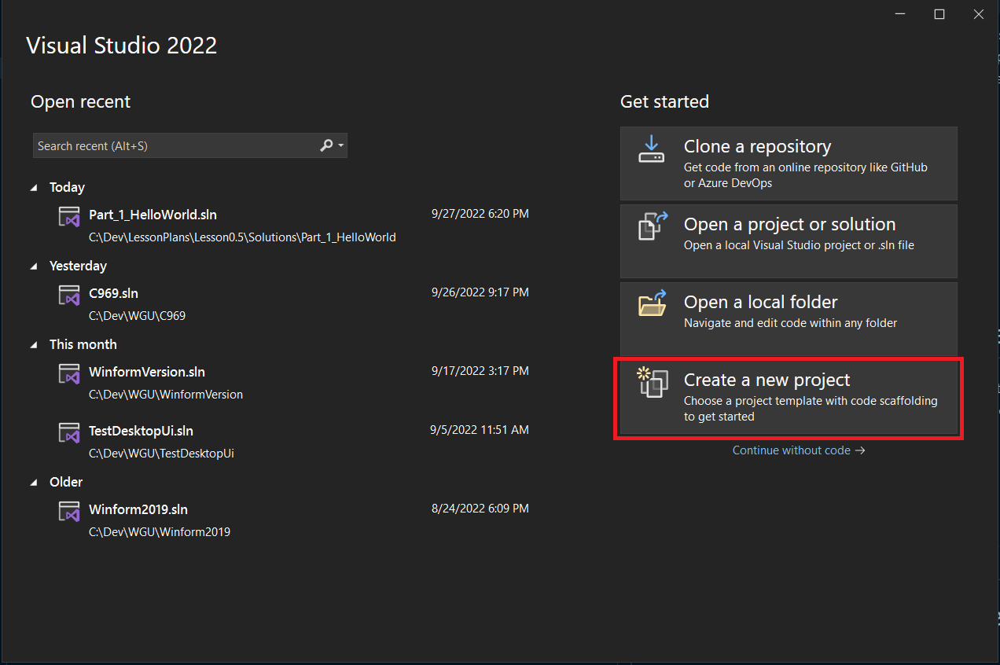
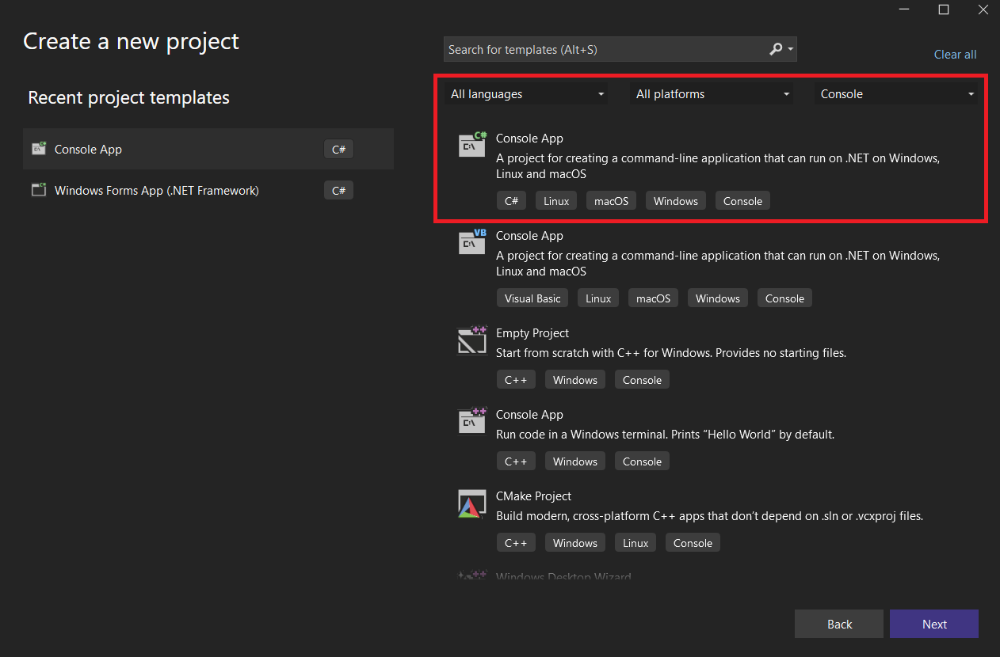

# Creating Console Applications and Reading/Writing To Console
## Prerequisites
- Visual Studio 2022
- Optional VS Code

## Overview
The easiest way to get started learning C# is through console applications.  Console applications have no UI and run in a terminal.
> NOTE: Terminal may also be referred to as Command Line, Command Prompt or Console
Within a console application, you have the ability to write text to the console, or read information in from a user.  

This first lesson is designed to make you feel comfortable with creating console applications in Visual Studio.  We will be focusing on .NET 6 Console applications.
  
> NOTE: .NET has gone through a number of versions and iterations.  You may hear reference to .NET Framework.  This was the original version of .NET, however it suffered from lack of compatibility with non-windows devices.  To address this, Microsoft moved onto creating .NET Core which was cross compatibile with Windows, Linux and MacOS.  Later they chose to drop the Core portion of the name and just refer to it as .NET with the current version.

This lesson will briefly touch upon creating variables, the string type, if statements, loops and using the Console library to read from and write to the console. Variables, types, if statements and loops will be focused on in more depth in future lessons.

## Setup a place for projects
Before we start the applications, we should setup a central location for our projects.  Traditionally I create a directory directly on the C Drive called Dev, becoming C:/Dev.

> NOTE: Directory and Folder are interchangeable

The reason for keeping it right on the C drive with a short directory name is that the projects we create there may end up with very long paths, and some applications have a max path length which may cause issues if we exceed it.

We can create this directory by:
- Open File Explorer, 
  - navigate to `This PC` 
  - Double click `Local Drive C:`
  - right click and select New > Folder
  - Name the folder Dev
- Open a command prompt:
    - type `cd C:/`
    - type `mkdir Dev`

# Console Application 1 - Hello World
This first console application will simply be creating the application using Visual Studio.  The Hello World string that is output to the screen is provided by default.

To Create a console application:
1. Open Visual Studio
2. Click Create a new Project

3. In the filter boxes leave the first two boxes as `All Languages` and `All Platforms` and set the third to `Console`, then select the `Console App` option and click next

4. In the Project Name box, name the project HelloWorld
5. In the Location box, navigate to the Dev directory created.
6. In the Solution box, name the solution Lesson_0_5 and click next
7. On the next page keep `.NET 6.0` selected for the framework
8. Check the box `Do not use top-level statements`
9. Click create
> NOTE: Top-level statements are new to .NET 6.  The goal was to reduce the amount of code needed to create the main fucntion, however results in the structure deviating from what the rest of the project will look like.

The end result will show a class called Program with a single function inside called Main.  Inside of that function there is a console statement that writes out hello world.

If you look at the solution explorer (should be visible on the left hand side of the screen, if not go to the view menu View > Solution Explorer), you will see the solution name at the top, then the project nested within that, then the files and classes inside of the projects.  A solution can have multiple projects.

To run the project, we can hit the play button (green triangle with the word Hello World next to it), or we can hit f5.
> NOTE: On most newer computers, they assume you're not going to use the function keys, so they override them with other options like volume screen brightness etc.  To use the function keys, you'll either need to hold down the `Fn` key and press the corresponding function key, or find the function lock.

When we run the program, a command prompt (console) will display, and at the top, we'll see the words `Hello, World!`, followed by some other text indicating the process has exited.  You can close the console window by pressing any key.

# Console Application 2 - Write To Console

# Console Application 3 - Read From Console

# Console Application 4 - Read From Console and Write Based on Input

# Console Application 5 - Create a Console Menu
